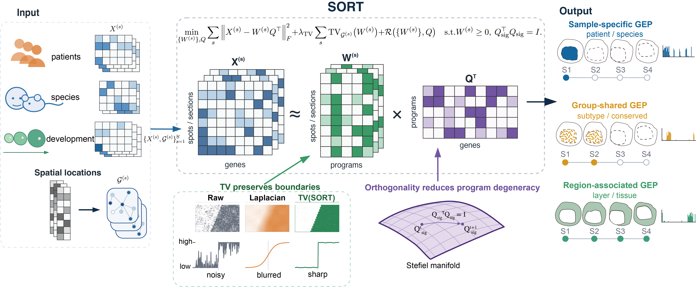

# SORT

[](LICENSE)
[](pyproject.toml)

SORT (Spatial Orthogonal Regularized Transcriptomic decomposition) is a method
for discovering gene-expression programs (GEPs) in spatial transcriptomic
atlases. It jointly decomposes normalized expression from multiple sections
into shared transcriptomic profiles and section-specific nonnegative spatial
activity maps, without requiring prior spatial alignment across sections.

Orthogonality separates the transcriptomic profiles into distinct directions,
while graph total variation promotes spatially coherent activity within tissue
regions and preserves sharp boundaries. This allows SORT to recover programs
that may be specific to one sample, shared within a biological group or active
in particular tissue regions.



## Features

- joint analysis of multiple spatial transcriptomic sections or samples;
- shared gene-expression profiles with sample-specific spatial activities;
- recovery of spatial programs at different biological scales;
- CPU and CUDA support;
- integration with `AnnData` and Scanpy workflows.

## Installation

```bash
git clone https://github.com/zerovain/SORT.git
cd SORT
conda env create -f environment.yml
conda activate sort-paper-release
python -m pip install -e . --no-deps
```

The tested environment is provided in `environment.yml`. GPU execution
requires a CUDA-compatible PyTorch installation and CuPy; otherwise SORT runs
on CPU.

## Basic usage

```python
import scanpy as sc
import sort

adata = sc.read_h5ad("prepared_spatial_data.h5ad")

sc.pp.normalize_total(adata, target_sum=1e4)
sc.pp.log1p(adata)
sc.pp.highly_variable_genes(adata, n_top_genes=3000, flavor="seurat_v3")
adata = adata[:, adata.var["highly_variable"]].copy()

sort.build_spatial_graph(adata, n_neighbors=8)
sort.compute_laplacian(adata)

result = sort.fit(adata, n_components=25)

print(result.W.shape)  # spatial locations × components
print(result.Q.shape)  # genes × components
```

For multiple samples stored in one `AnnData` object, SORT can construct a
separate spatial graph for each sample:

```python
sort.build_per_sample_graph(
    adata,
    n_neighbors=8,
    sample_key="sample_id",
)
```

## Output

- `result.W` contains the nonnegative spatial activity of each component at
  each spatial location;
- `result.Q` contains the corresponding gene weights shared across samples.

The requested `n_components` includes one background component. The first
component (Python index `0`, reported as GEP00 in the manuscript) captures the
broad background expression fitted by the model. The remaining components are
the signal GEPs used for biological interpretation. For example,
`n_components=25` returns one background component and 24 signal GEPs.

## Tutorials and documentation

Detailed tutorials are available in the
[SORT_tutorial repository](https://github.com/zerovain/SORT_tutorial):

[Online documentation](https://sort-tutorial.readthedocs.io/)

- [Simulated spatial atlas](https://github.com/zerovain/SORT_tutorial/blob/main/notebooks/00_simulated_atlas.ipynb)
- [PDAC atlas](https://github.com/zerovain/SORT_tutorial/blob/main/notebooks/01_pdac_atlas.ipynb)
- [Mouse embryogenesis atlas](https://github.com/zerovain/SORT_tutorial/blob/main/notebooks/02_embryogenesis.ipynb)

## Citation

Citation information will be provided upon publication of the associated
manuscript.

## License

SORT is released under the [MIT License](LICENSE).

## Support

Please report bugs and usage questions through the
[GitHub issue tracker](https://github.com/zerovain/SORT/issues).
